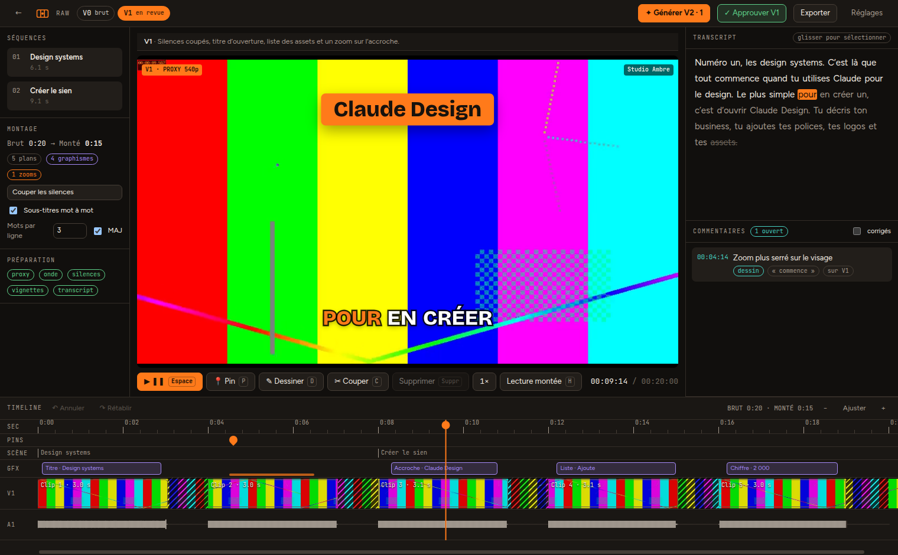

# Rushcut

Éditeur vidéo desktop (Mac et Windows) assisté par IA. Claude monte la vidéo à partir du transcript. Tu commentes au timecode, tu dessines sur l'image, et Claude produit la V2, puis la V3.



## Installer et lancer

Prérequis : Node.js 20 ou plus récent.

```bash
npm install
npm run dev
```

Au premier lancement, la fenêtre Réglages s'ouvre. Colle tes clés **Claude (Anthropic)** et **ElevenLabs**. Elles sont chiffrées avec le trousseau du système.

## Créer l'installeur

L'installeur se construit sur la machine visée, car ffmpeg est téléchargé pour le système qui lance `npm install`.

Sur un Mac, on obtient un `.dmg` dans `dist/` :

```bash
npm run dist:mac
```

Sur un PC Windows, on obtient un installeur `.exe` dans `dist/` :

```bash
npm run dist:win
```

L'app n'est pas signée. Au premier lancement :
- sur Mac : clic droit sur l'app, puis **Ouvrir** ;
- sur Windows : **Informations complémentaires**, puis **Exécuter quand même**.

## Comment ça marche

1. **Import** (une seule fois par rush) : ffmpeg crée un proxy 540p avec l'encodeur matériel (VideoToolbox, NVENC, QuickSync ou AMF). Il calcule aussi la forme d'onde, les silences et une planche de vignettes.
2. **Transcription** : ElevenLabs Scribe renvoie chaque mot avec son timecode. Rien ne tourne sur ton CPU.
3. **V1** : Claude lit le transcript et écrit un fichier de montage JSON (`edl/V1.json`). Ce fichier contient les coupes, les séquences, les zooms, le motion design et les sous-titres. Aucune vidéo n'est rendue à ce stade.
4. **Revue** : la lecture saute les passages coupés. Le motion design s'affiche par-dessus en HTML, sans rendu. Tu poses tes remarques :
   - **P** pour un pin au timecode ;
   - **D** pour dessiner (crayon, cercle, flèche, rectangle, 4 couleurs), puis **Joindre ↵**.
5. **V2, V3…** : Claude reçoit les commentaires ouverts et l'image dessinée. Il renvoie le montage corrigé et les commentaires traités passent en « corrigé en V2 ».
6. **Export** : le rendu part du rush original.
   - Chaque segment est mis en cache : une V3 qui touche deux coupes ne ré-encode que ces deux coupes.
   - Le motion design est capturé seulement aux instants où il change (170 images pour 15 s au lieu de 450).

### Copier le montage d'une vidéo d'exemple

Dans **Générer V1**, choisis une vidéo dont tu aimes le montage. Rushcut y détecte les coupes et Claude examine les images clés. Il en tire une recette (rythme, zooms, sous-titres, graphismes, structure), que Claude applique ensuite à ton rush.

### Design systems

Quatre styles sont fournis. **+ Nouveau** crée un design system à partir d'une capture d'écran, d'un deck ou d'un site : Claude en extrait les couleurs, la police et les arrondis.

## Raccourcis

| Touche | Action |
|---|---|
| Espace | Lecture / pause |
| ← → (Maj : 1 s) | Image par image |
| P | Pin au timecode |
| D | Dessiner sur l'image |
| C | Couper à la tête de lecture |
| Suppr | Supprimer le plan, le graphisme ou les mots sélectionnés. Sur une zone hachurée, restaure le passage |
| H | Lecture montée ou lecture brute |
| ⌘/Ctrl+Z, ⇧⌘Z | Annuler, rétablir |
| ⌘/Ctrl + molette | Zoom de la timeline |

Dans le transcript, fais glisser la souris sur des mots puis appuie sur **Suppr** : ils sont coupés de la vidéo. Refais la même chose sur des mots barrés pour les restaurer.

## Fichiers d'un projet

Les projets sont dans `Documents/Rushcut/<projet>/` :

| Fichier | Contenu |
|---|---|
| `project.json` | réglages, versions |
| `edl/V*.json` | un montage par version |
| `words.json` | transcript |
| `comments.json`, `comments/*.jpg` | commentaires et images annotées |
| `proxy.mp4`, `sprite.jpg`, `peaks.bin` | médias légers pour l'édition |
| `cache/`, `exports/` | segments rendus, MP4 finaux |

Le rush original n'est jamais copié ni modifié.

## Pas encore fait

- Musique, effets sonores et voix ElevenLabs.
- Recadrage 9:16 qui suit le visage (MediaPipe).
- Plusieurs rushes dans un même projet.
- Images d'illustration générées.
